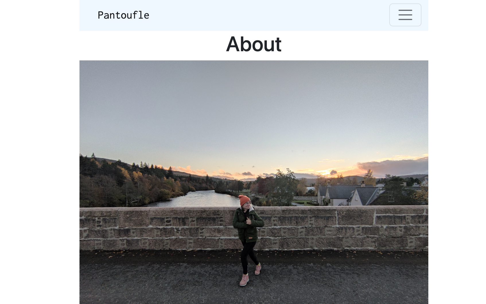

# Pantoufle Blog

## Description

This blog is built using the Python-based web framework Django, following the teaching of William Vincent in his book [Django for Beginners](https://djangoforbeginners.com/).

## Title

The name 'Pantoufle' means 'sleeper' in French. I picked the name as I love the sound of it and because it has a connotation of comfort and coziness.

## Blog structure 

The blog is in its early stages but already contains its main elements: 
- an about section
- a blog
- a photo gallery
  
The aim is to document my journey in learning web development in the form of a learning journal / blog, as well as other elements. It will mostly be Bristol-focused, especially in the photo gallery section.

You can find my repo here: [GitHub repo](https://github.com/helenesauve/pantoufle)

